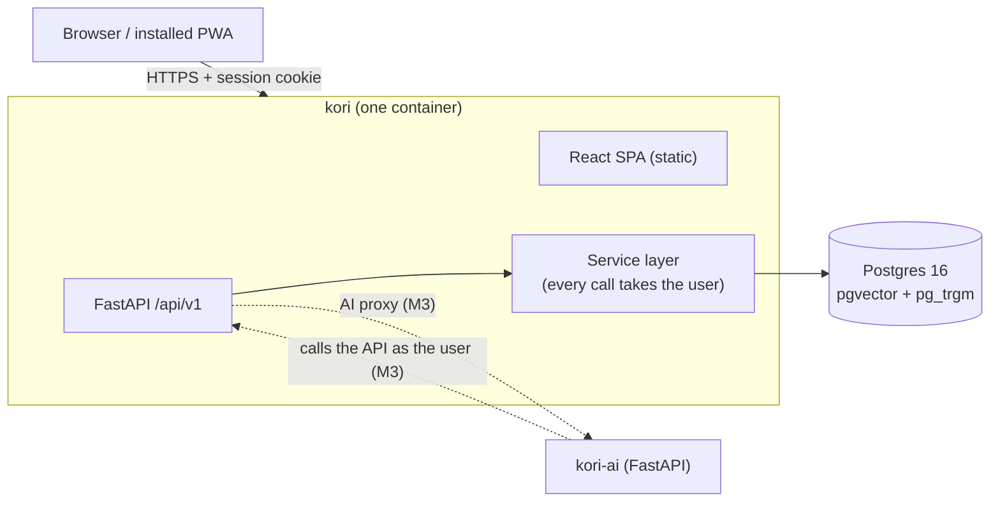

# Kori (কড়ি)

**A personal expense and budget app that grows into an AI assistant.**
It's named after the cowrie shells (কড়ি) once used as money in Bengal.

> **Status: pre-alpha.** Milestone 1 ("Log it, live") is in progress. See the [roadmap](ROADMAP.md).

## Why Kori

- **Daily use.** I track my spending in BDT (cash, bKash, cards) and want a fast, private tool that
  works well on my phone.
- **An AI-engineering lab.** Over time Kori will answer questions about my money, take actions on my
  behalf (always with my confirmation), and surface insights in the background. Each capability is
  built in stages and measured with evals.
- **Built properly.** Small reviewed PRs, tests against a real Postgres, CI on every change, and
  written architecture decisions.

## Planned features

| Milestone | What you get |
|---|---|
| **M1 · Log it, live** | Login, fast expense and income entry on phone (installable PWA), split transactions and tags, a monthly list with totals and search, and deployment on free-tier hosting |
| **M2 · Plan it** | Monthly budgets, a dashboard, a split editor, recurring transactions |
| **M3 · AI seams** | The contract and auth between Kori and `kori-ai`, an assistant panel, quick-add, confirmation cards, an insights card |
| **M4–M8 · AI track** | Natural-language entry, Q&A over my data using tools, an agent with confirmed actions, auto-categorization and anomaly alerts, evals and tracing |

See [ROADMAP.md](ROADMAP.md) for the full plan.

## Architecture at a glance

Kori owns the financial data. The AI service is only a client of Kori's API: it acts **as the
logged-in user**, so it can never see or change more than the user can. Details are in
[docs/architecture.md](docs/architecture.md).

## Repositories

| Repo | Purpose |
|---|---|
| **kori** (this repo) | Web app (React) and API (FastAPI), plus the database migrations, infrastructure and docs |
| [**kori-ai**](https://github.com/monjurul0007/kori-ai) | The AI service: parsing, Q&A, agent, background insights (stubs until M4) |

## Tech stack

| Layer | Choice |
|---|---|
| API | Python 3.12, FastAPI, SQLAlchemy 2, Alembic, Pydantic v2, uv |
| Database | Postgres 16 with pgvector and pg_trgm |
| Web | React, TypeScript, Vite, TanStack Query, Tailwind CSS with shadcn/ui, installable PWA |
| Quality | pytest against real Postgres, Vitest, React Testing Library, Playwright; ruff, mypy, ESLint |
| Delivery | Docker, GitHub Actions, GHCR, free-tier hosting (see spike S2) |

The reasoning behind each choice is in [ADR-0002](docs/adr/0002-tech-stack.md).

## Getting started

There's no application code yet. The API skeleton lands in M1-02 and a one-command local stack
(`docker compose up`) in M1-15. Until then, this repo holds the conventions and design docs.

## Project docs

- [ROADMAP.md](ROADMAP.md): milestones and their status
- [docs/architecture.md](docs/architecture.md): components, principles and the planned data model
- [docs/adr/](docs/adr/README.md): architecture decision records
- [CONTRIBUTING.md](CONTRIBUTING.md): branching, commits, PR rules and the definition of done

## How this project is built

I own the product and review every PR. Implementation is pair-programmed with Claude Code:
- The backlog lives on a Trello board.
- Each task card becomes one small, focused PR, following [CONTRIBUTING.md](CONTRIBUTING.md) and
  [CLAUDE.md](CLAUDE.md).
- I build the AI features (M4–M8) myself, as part of moving into AI/ML engineering.

## License

[MIT](LICENSE) © 2026 Monjurul Hoque
