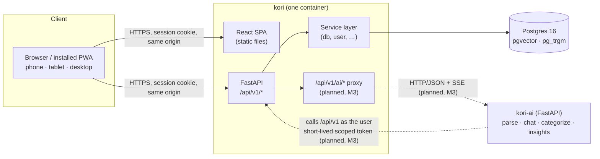
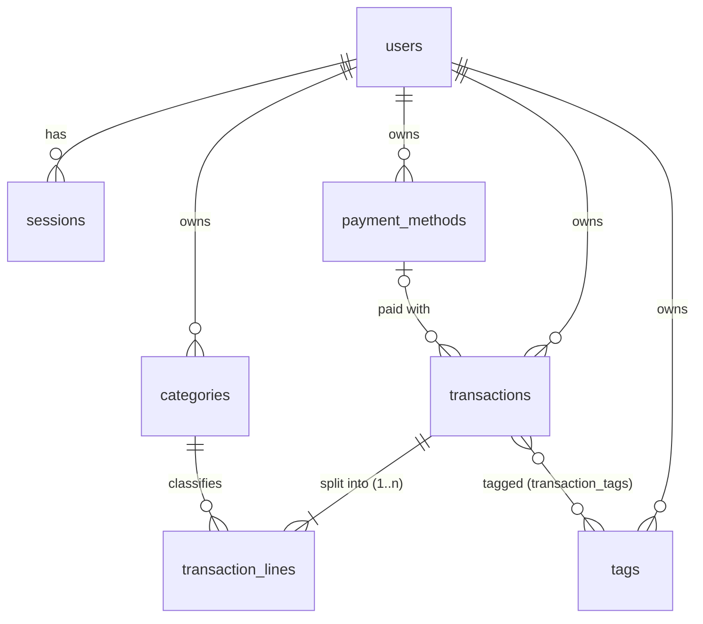

# Architecture

This document describes the **target shape at the end of M3**. Parts marked *(planned)* don't
exist yet. The linked ADRs explain why things are this way.

## Components

| Component | Repo | Responsibility |
|---|---|---|
| **Web** (`apps/web`) | kori | React SPA: login, transactions, budgets, and the AI UI slots. Built into static files that the API container serves |
| **API** (`apps/api`) | kori | REST API, auth, validation and the service layer. **The only component that reads or writes financial data** |
| **Postgres** | — | App data, and embeddings later (pgvector). Search uses trigram indexes (pg_trgm) |
| **kori-ai** | kori-ai | AI capabilities behind stable interfaces. Stubs until M4 |

## Principles

1. **Kori owns the data.** Every read and write goes through the service layer. Service functions
   take the user explicitly (`fn(db, user, …)`) and always filter by `user.id`. These same functions
   later become the AI's tools.
2. **The AI is only a client.** `kori-ai` calls Kori's public API **as the logged-in user**, using a
   short-lived, user-scoped token (M3). It can never see or change more than the user can. Scoping
   is enforced in the backend, never in a prompt. See
   [ADR-0003](adr/0003-two-repo-split.md).
3. **AI writes are proposals.** Creating, editing or deleting a record needs the user's
   confirmation in the UI. Fields the AI sets are marked (`source = ai`, `category_source = ai`)
   and can be undone.
4. **One origin for the browser.** The SPA and the API share an origin. That means no CORS setup,
   a `SameSite=Lax` session cookie, and simple CSRF rules.

## Cross-cutting conventions

| Concern | Convention |
|---|---|
| API shape | REST under `/api/v1`, cursor pagination, UUID ids |
| Errors | RFC 9457 `application/problem+json`, always with `request_id` |
| Money | Decimal strings in taka over the API; integer poisha in the DB ([ADR-0004](adr/0004-money-and-dates.md)) |
| Dates | `occurred_on` is a local calendar date (Asia/Dhaka); audit columns are `timestamptz` |
| Auth | argon2id passwords; server-side sessions (hashed token); HttpOnly cookie; Origin check on unsafe methods |
| Logs | Structured JSON with a request ID; secrets and tokens are never logged |
| Contracts | A committed `openapi.json` produces a typed TypeScript client (web) and a Python client (kori-ai); CI fails on drift |

## Data model (planned, M1)

- **`transactions`:** `type` (expense or income), `occurred_on` (local date), `amount_minor`
  (bigint poisha), `merchant`, `note`, `payment_method_id`, and `source` (manual, ai, recurring,
  import or seed).
- **`transaction_lines`:** every transaction has one or more lines, and a **split** is just more
  than one. A deferred constraint trigger checks that the lines add up to the transaction amount.
  Each line carries `category_source` and `category_confidence`, the seam for auto-categorization.
- **`categories` and `payment_methods`:** archived, never deleted, so history stays intact.
- **Later:**
  - `budgets` and `recurring_rules` in M2
  - `insights` in M3
  - embeddings, whose location spike S1 decides

The full schema lands with M1-05 in `docs/data-model.md`.

## Deployment (planned)

- **Local:** `docker compose up` runs Postgres and the app container. Migrations run on start.
- **Production:**
  - free-tier container hosting plus a managed Postgres with pgvector, chosen by spike S2
  - GitHub Actions builds the image, pushes it to GHCR, migrates the database, then deploys
- **Later (M10):** Kubernetes (k3s) with Helm and a self-hosted model on vLLM.

## Decision records

See [docs/adr](adr/README.md).
