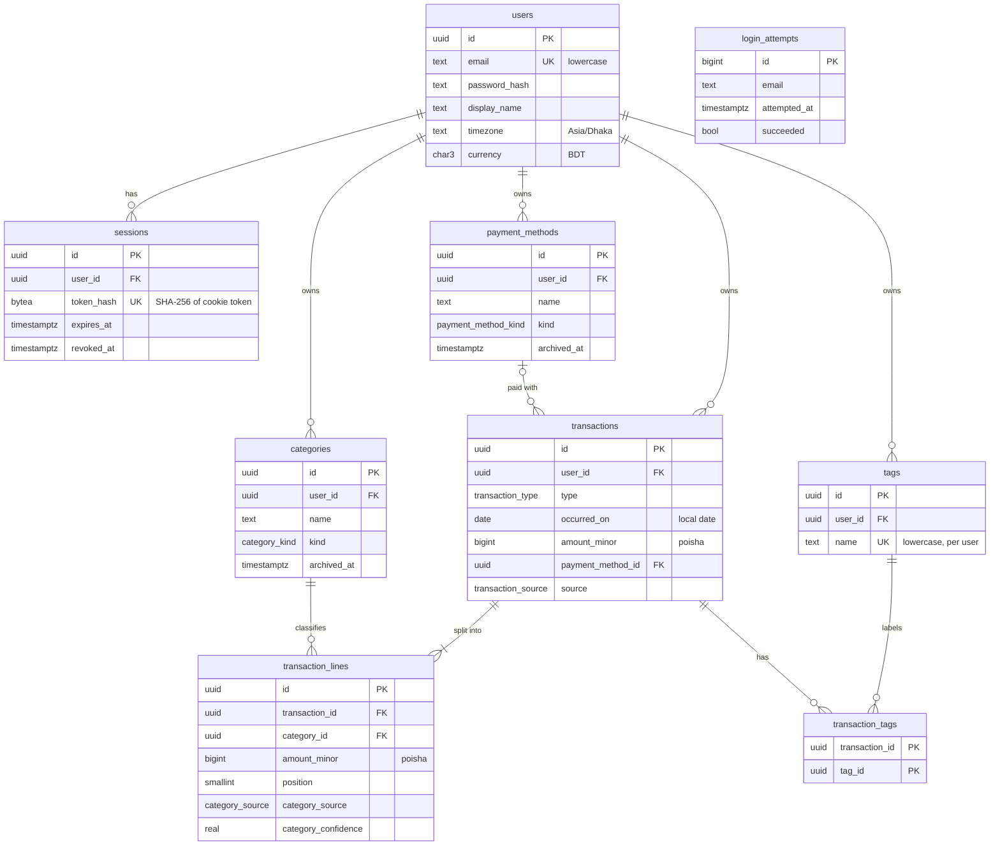

# Data model

The core schema from M1-05. Models live in `apps/api/src/kori/<feature>/models.py`; the single
migration is `apps/api/migrations/versions/0002_core_data_model.py`. Money and date rules come
from [ADR-0004](adr/0004-money-and-dates.md).

## Design choices

- **Keys and timestamps.** UUID primary keys (`gen_random_uuid()`), `timestamptz` audit columns,
  and `updated_at` set by SQLAlchemy `onupdate`. Enums are native Postgres ENUM types, so the
  database rejects unknown values.
- **Money is integer poisha** (`amount_minor bigint`, `CHECK > 0`). Direction comes from
  `transactions.type`, never from a sign. Floats are never used.
- **`occurred_on` is a `date`**, the user's local calendar day, so "this month" never shifts with UTC.
- **Splits are lines.** Every transaction has one or more `transaction_lines`; a split is just more
  than one. Categories live on lines only, so there is one code path for split and unsplit.
- **Split integrity is enforced in the database.** A deferred constraint trigger
  (`check_transaction_lines_sum`) runs at commit and requires at least one line and
  `SUM(lines) = transactions.amount_minor`, raising SQLSTATE `23514`. It fires on line
  INSERT/UPDATE/DELETE and on transaction INSERT or `amount_minor` UPDATE, and skips transactions that
  no longer exist. Writers must insert the transaction and its lines in one transaction.
- **AI provenance.** `transactions.source` and `transaction_lines.category_source` /
  `category_confidence` mark values the AI set, per the "AI never writes directly" rule.
- **Archiving, not deleting, categories and payment methods.** Names are unique per user among active
  rows only (partial unique index on `lower(name)`), so an archived name can be reused.
- **`ON DELETE` rules.** User-owned tables cascade from `users`. `transaction_lines` and
  `transaction_tags` cascade from their transaction. `lines.category_id` and
  `transactions.payment_method_id` are `RESTRICT` so history is never silently orphaned.
- **Sessions store only a SHA-256 hash** of the cookie token. `login_attempts` has no `user_id`
  because attempts can name an unknown email; it supports throttling.
- **Search and pagination indexes.** `(user_id, occurred_on DESC, created_at DESC, id DESC)` serves
  keyset pagination; `gin_trgm_ops` indexes on `merchant` and `note` serve fuzzy search.

## Known consequences and open questions

- **Deleting a user.** `RESTRICT` is checked immediately, so `DELETE FROM users` fails while the user
  still has transactions (the cascade reaches `categories` before the lines are gone). Account deletion
  must delete the user's transactions first. Switching those two foreign keys to `NO ACTION` would
  allow a single cascading delete while still rejecting deletes of in-use categories. Owner to decide.
- **Cross-user references.** The service layer (M1-08) checks that the category, payment method and
  tags belong to the transaction's user. Composite `(user_id, id)` foreign keys would make this a
  database guarantee, at the cost of extra unique indexes and wider keys. Left open for review.
